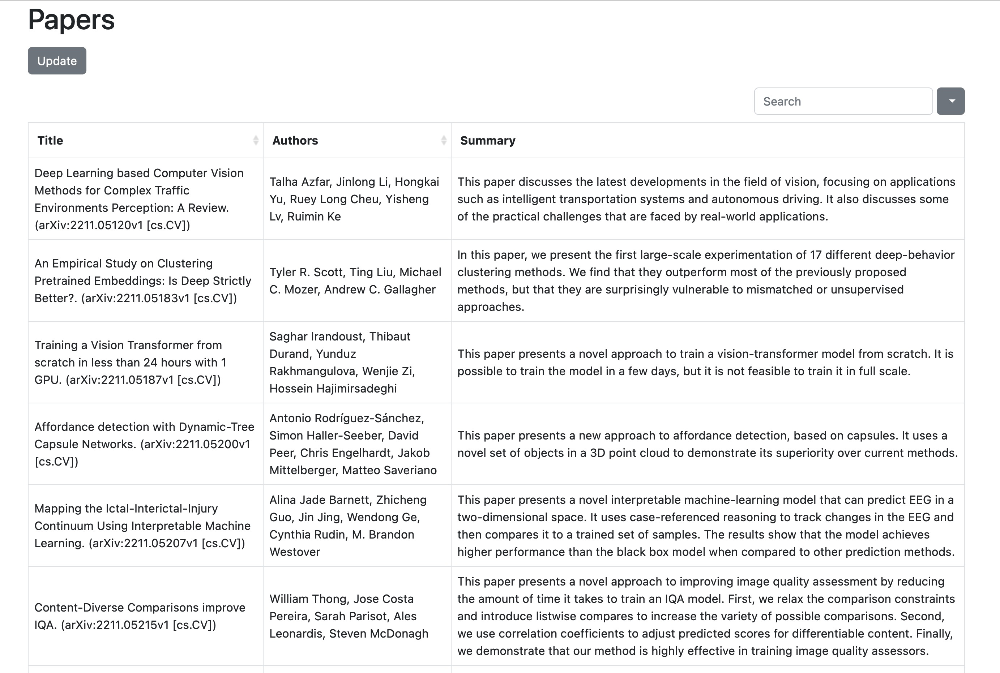

# arXiv Paper Summarizer

This is a simple app which summarizes all new papers on arXiv under the Computer Science — Computer Vision category.

The app will store all downloaded paper information and summaries in a local database and will fetch new papers any time you click on the "Update" button on the UI. It will summarise only new papers which are not in the database currently so as to save on resources.

The list of papers can be searched and sorted and you can page through the whole list as you like.

You can tap on any item you are interested in and it will prompt you as to whether you want to view the paper on arXiv. If you say "Yes", it will open the page for the paper in a new browser tab.

The basic UI can be seen below:

## How does it work?

The app fetches the RSS feed for the hardcoded category (cs.CV) and then compares each paper against those already in the database. Any paper which is not found in the database has its description passed through the summarizer which uses [this model](https://huggingface.co/pszemraj/long-t5-tglobal-base-16384-book-summary).

You can use a different model which supports text summarizing instead of this one and it might possibly yield better results. I have not done enough testing yet to see if there is a better model that can be used. If you do find one, do let me know 🙂

## Does this work only with arXiv?

As the code stands now, yes, it only works with arXiv. But if you have other RSS feeds (or even different sources of papers) that you want to use with this code, it should be fairly straightforward to modify the code to work with these other sources provided they provide some sort of a description of the paper that can be summarized.

## Future Plans

I do want to add at least the following features to the app:

- [ ] The ability to delete/hide papers that I'm not interested in
- [ ] The ability to not have deleted/hidden papers be downloaded/summarized again
- [ ] The ability to add more than one category on arXiv to fetch papers from
- [ ] The ability to switch between different categories (once the above feature is in)